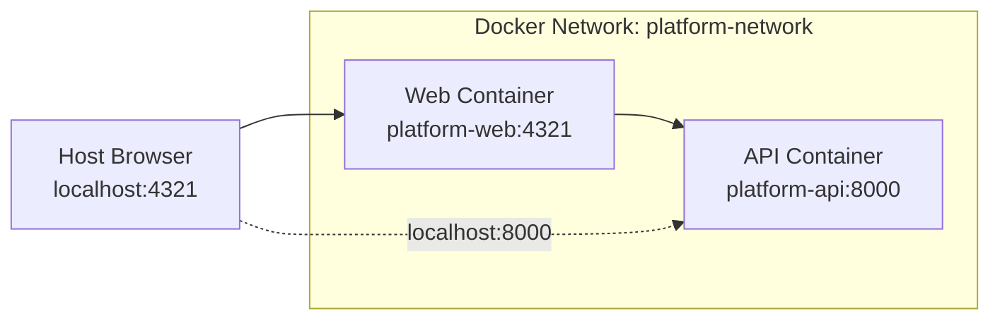

# Local Service Orchestration (Docker Compose)

Docker Compose provides a lightweight alternative to Kubernetes for local development and testing. It orchestrates both services (API and Web) on a single network, enabling validation of inter-service communication before deploying to Kubernetes.

## Purpose

- **Test service communication**: Verify API and Web can reach each other using service names
- **Validate container builds**: Ensure Dockerfiles produce working images
- **Debug networking**: Isolate network issues from Kubernetes complexity
- **Rapid iteration**: Faster startup than kind cluster provisioning

This is not a replacement for the Kubernetes-based deployment flow. It serves as a **pre-flight check** before promoting images to the GitOps pipeline.

## Architecture

Docker Compose creates an isolated bridge network where containers discover each other by service name. This mirrors Kubernetes service discovery but with simpler networking (single flat namespace instead of cross-namespace DNS).



**Key differences from Kubernetes:**

| Aspect | Docker Compose | Kubernetes |
|--------|----------------|------------|
| Service Discovery | `http://api:8000` | `http://api.platform-api:8000` |
| Namespace Isolation | Single flat network | Cross-namespace DNS required |
| Health Checks | Built into compose spec | Defined in Pod spec |
| Restart Policy | Per-service (`unless-stopped`) | Controller-managed (Deployment) |

## Configuration

The compose specification lives at `docker-compose.yml` in the repository root. It defines two services and a custom bridge network.

### Service Definitions

**api:**

- Build context: repository root (allows `COPY services/api/...`)
- Exposed port: `8000:8000` (host:container)
- Health check: Python script calling `/health` endpoint
- Network: `platform-network`

**web:**

- Build context: repository root
- Build argument: `PUBLIC_API_URL=http://api:8000` (service name for Docker network)
- Exposed port: `4321:4321`
- Dependency: waits for API to be healthy before starting
- Network: `platform-network`

???+ info "Build argument necessity"
    The web service requires `PUBLIC_API_URL` as a **build argument** (not just runtime environment variable) because Astro/Vite compiles environment variables into the JavaScript bundle at build time. See [Web Service Container Build](../services/web.md#container-build) for details.

### Network Configuration

The `platform-network` bridge network enables service-to-service communication:

- **DNS resolution**: Service names (`api`, `web`) resolve to container IPs automatically
- **Isolation**: Containers cannot reach host localhost or other Docker networks by default
- **Port mapping**: Only explicitly mapped ports are accessible from the host

### Health Checks and Dependencies

The web service declares `depends_on` with `condition: service_healthy`, ensuring startup order:

1. API container starts
2. API health check runs every 10s (up to 3 retries)
3. Once API reports healthy, web container starts
4. Web health check validates the web server is responding

This prevents race conditions where the web service attempts API calls before the API is ready.

## Common Operations

### Start Services

```bash
docker compose up -d
```

Both services build (if needed) and start in detached mode. API must pass health checks before web starts.

### View Logs

```bash
# Follow all logs
docker compose logs -f

# View specific service
docker compose logs -f web
docker compose logs -f api
```

### Check Status

```bash
docker compose ps
```

Shows container state, ports, and health status.

### Rebuild After Code Changes

```bash
# Rebuild specific service
docker compose build web

# Rebuild and restart
docker compose up -d --build
```

???+ warning "Web service rebuilds"
    Any change to `PUBLIC_API_URL` or Astro source files requires rebuilding the web service. Runtime environment variables do not affect the compiled JavaScript bundle.

### Stop and Remove

```bash
# Stop containers (keeps images and network)
docker compose down

# Stop and remove volumes (if any were defined)
docker compose down -v
```

## Accessing Services

### From Your Browser (Host Machine)

If running in a devcontainer, port forwarding must be configured. See `.devcontainer/devcontainer.json`:

```json
"forwardPorts": [8000, 4321]
```

Once ports are forwarded:

- **API**: `http://localhost:8000/health`
- **Web**: `http://localhost:4321/`
- **Web Status Page**: `http://localhost:4321/status` (shows API health check result)

### Between Containers (Docker Network)

Containers use service names as hostnames:

- Web calls API: `http://api:8000/health`
- API is reachable at: `http://api:8000`

This matches the `PUBLIC_API_URL` build argument passed to the web service.

## Verification Checklist

After starting the stack, verify:

1. **API health**: `curl http://localhost:8000/health` returns `{"healthy":true}`
2. **Web accessibility**: `curl http://localhost:4321/` returns HTML
3. **Inter-service communication**: Visit `http://localhost:4321/status` and confirm "Backend is healthy"
4. **Container health status**: `docker compose ps` shows both services as `healthy`

If the status page shows "Backend is unavailable" but the API responds to direct curl:

- The web image was likely built with the wrong `PUBLIC_API_URL`
- Rebuild with: `docker compose build web && docker compose up -d web`

## Comparison with Kubernetes

Docker Compose validates the same contracts enforced by Kubernetes:

| Contract | Docker Compose | Kubernetes |
|----------|----------------|------------|
| Container images | Built locally, tagged `latest` | Built and pushed to registry |
| Health checks | HTTP/command-based | Liveness/readiness probes |
| Service networking | Bridge network DNS | CoreDNS with namespace isolation |
| Resource limits | Optional (not enforced by default) | Requests and limits in Pod spec |

The Kubernetes manifests in `gitops/apps/local/` define the same services with stricter resource constraints and cross-namespace networking. See [Local Kubernetes Architecture](local-kubernetes.md) for the kind-based deployment flow.

## See Also

- [API Service](../services/api.md) - API endpoints and container build
- [Web Service](../services/web.md) - Frontend pages and Astro build process
- [Local Kubernetes Architecture](local-kubernetes.md) - kind cluster setup for GitOps testing
- [Developer Setup](../dev/developer-setup.md) - Devcontainer and tooling configuration
