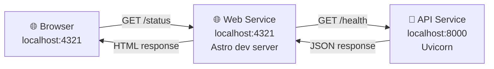

# Layer 0: Local Execution

Running both services directly on your machine using their native runtimes.

## Why Layer 0?

This is the **simplest way to understand what each service does**. No Docker, no networking complexity—just Python and Node.js running locally.

## Starting the API Service

The API is a FastAPI application written in Python.

### Prerequisites

- Python 3.14+
- `uv` package manager (installed automatically by `mise`)

### Commands

```bash
cd services/api
uv sync
uv run api
```

### What You Should See

```sh
2026-02-17 20:14:13,440 - __main__ - INFO - Configuration loaded successfully
2026-02-17 20:14:13,440 - __main__ - INFO - FastAPI app created
2026-02-17 20:14:13,440 - __main__ - INFO - Starting uvicorn server on 0.0.0.0:8000
2026-02-17 20:14:13,504 - uvicorn.error - INFO - Started server process [1]
2026-02-17 20:14:13,504 - uvicorn.error - INFO - Waiting for application startup.
2026-02-17 20:14:13,505 - api.app - INFO - api starting
2026-02-17 20:14:13,505 - uvicorn.error - INFO - Application startup complete.
2026-02-17 20:14:13,513 - uvicorn.error - INFO - Uvicorn running on http://0.0.0.0:8000 (Press CTRL+C to quit)
```

### Testing the API

In another terminal:

```bash
# Health check
curl http://localhost:8000/health
# Expected: {"healthy":true}

# Info endpoint
curl http://localhost:8000/info
# Expected: {"name":"gitops-deployment-platform",...}

# Root
curl http://localhost:8000/
# Expected: {"service":"gitops-deployment-platform","status":"ok"}
```

## Starting the Web Service

The Web is an Astro application with Node.js runtime.

### Prerequisites

- Node.js 20+
- `pnpm` package manager (installed automatically by `mise`)

### Commands

```bash
cd services/web
pnpm install
PUBLIC_API_URL=http://localhost:8000 pnpm dev --host 0.0.0.0
```

### What You Should See

```sh
  vite v5.x.x building for production...
  ✓ 47 modules transformed.

  built in 2.45s

  ▶ Preview server running at:
  ├ Local: http://localhost:4321
  ├ Network: http://172.x.x.x:4321
```

...then in development mode:

```sh
  Local: http://localhost:4321
  Network: http://0.0.0.0:4321
```

### Testing the Web

Open your browser: `http://localhost:4321`

Expected:

- Landing page with navigation to `/status` and `/info`
- `/status` shows "Backend is healthy" (calls `http://localhost:8000/health`)
- `/info` shows backend metadata (calls `http://localhost:8000/info`)

## How They Communicate (Layer 0)

Both services run on `localhost`, so the **Web can directly reach the API**:



**Key point:** The Web service needs to know where the API is. This is set via the `PUBLIC_API_URL` environment variable:

```bash
PUBLIC_API_URL=http://localhost:8000 pnpm dev --host 0.0.0.0
```

## Environment Variables in Layer 0

### PUBLIC_API_URL

- **What it does**: Tells the Web where to find the API
- **Value**: `http://localhost:8000`
- **Why this value**: API runs on localhost, port 8000
- **Can change at runtime**: ✅ Yes (Web reloads and picks up the new value)
- **Example**:

  ```bash
  PUBLIC_API_URL=http://localhost:9000 pnpm dev  # Different API port
  ```

### Other Variables (Layer 0)

- `PORT=8000` (API) - Hardcoded in Dockerfile, but can override:

  ```bash
  PORT=9000 uv run api  # API listens on 9000
  ```

- `LOG_LEVEL=info` (API) - Can override:

  ```bash
  LOG_LEVEL=debug uv run api  # More verbose logging
  ```

## Stopping Services

Press `Ctrl+C` in each terminal to stop the services gracefully.

## What Works in Layer 0

- ✅ **Rapid iteration**: Change code, save, auto-reload
- ✅ **Easy debugging**: See logs directly in terminal, use Python/Node debuggers
- ✅ **Full service functionality**: Both services work completely
- ✅ **Direct configuration**: Environment variables take effect immediately

## What Doesn't Work in Layer 0

- ❌ **Not production-like**: No containerization, no isolation
- ❌ **Not reproducible**: Depends on local environment (Python version, npm packages)
- ❌ **Manual management**: Have to manage two separate applications manually
- ❌ **No testing of containers**: Can't verify Dockerfiles or images

## Next: Layer 1

When you're ready to test **individual Docker images** and understand container networking, see [Layer 1: Docker Images](layer-1-docker-images.md).
