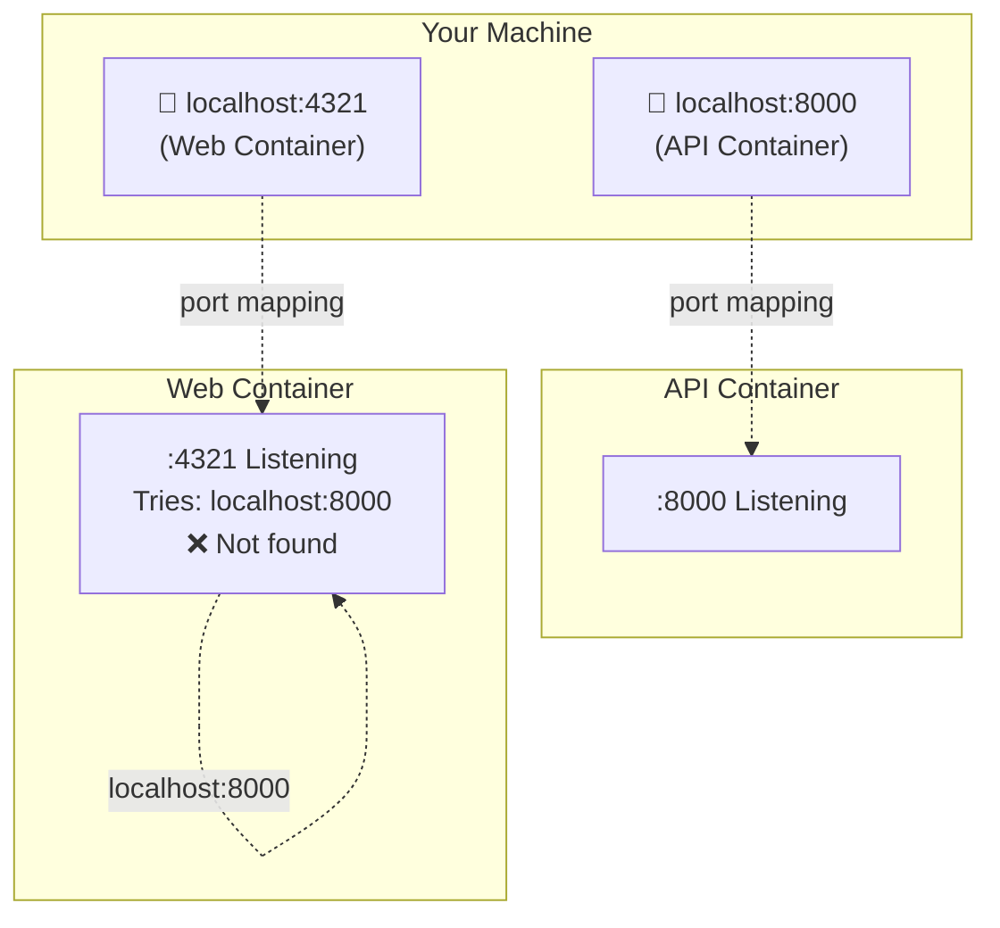
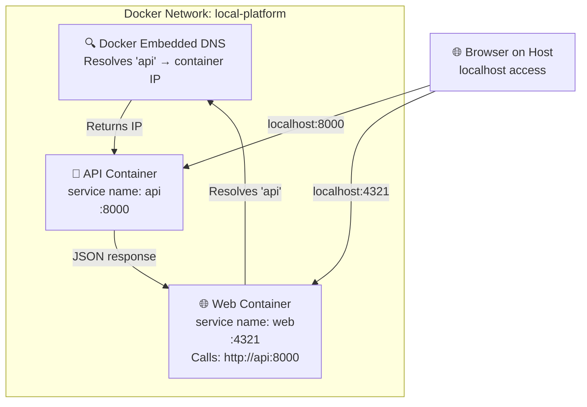

# Layer 1: Individual Docker Images

Running each service in its own Docker container, separately.

## Why Layer 1?

This layer demonstrates **what happens when you containerize services individually**. The challenge: how do two isolated containers communicate?

## Quick Start: Automated Setup

If you just want to **get the system running**, use the provided scripts:

```bash
# Start everything (builds, creates network, runs containers)
./scripts/docker-run-local.sh
```

The script will:

- Build both Docker images
- Create a shared Docker network (`platform-net`)
- Stop and remove any old containers
- Start the API and Web containers

Access the services:

- API: `http://localhost:8000`
- Web: `http://localhost:4321`

To stop everything:

```bash
./scripts/docker-stop-local.sh
```

See [`scripts/docker-run-local.sh`](../../scripts/docker-run-local.sh) and [`scripts/docker-stop-local.sh`](../../scripts/docker-stop-local.sh) for implementation details.

---

## Manual Approach: Understanding the Steps

If you want to **understand how each step works**, follow this manual process:

## Building Docker Images (Manual)

### Build the API Image

```bash
docker build -t api:latest -f services/api/Dockerfile .
```

What happens:

```sh
[+] Building 50.2s
 => [api internal] load build definition from Dockerfile
 => [api stage-0] FROM docker.io/library/python:3.14-slim
 => [api stage-0] COPY services/api/pyproject.toml ./pyproject.toml
 => [api stage-0] RUN uv pip install -r pyproject.toml
 => [api stage-0] COPY services/api/src ./src
 => exporting to image
 => => naming to docker.io/library/api:latest
✔ api:latest Built
```

Verify:

```bash
docker images | grep api
# You should see: api  latest  <image-id>  <date>
```

### Build the Web Image

```bash
docker build \
  -t web:latest \
  -f services/web/Dockerfile \
  --build-arg PUBLIC_API_URL=http://localhost:8000 \
  .
```

What happens:

```sh
[+] Building 20.7s
 => [web build] FROM docker.io/library/node:20-alpine
 => [web build] RUN pnpm install --frozen-lockfile
 => [web build] RUN pnpm build
 => [web stage-1] FROM docker.io/library/node:20-alpine
 => [web stage-1] COPY --from=build /app/dist ./dist
 => exporting to image
 => => naming to docker.io/library/web:latest
✔ web:latest Built
```

**Important**: Notice `--build-arg PUBLIC_API_URL=http://localhost:8000`. This is baked into the web image at build time.

## Running Docker Images Separately

### Run the API Container

```bash
docker run -d \
  --name api-container \
  -p 8000:8000 \
  -e LOG_LEVEL=info \
  api:latest
```

What happens:

```sh
<container-id>
```

Verify it's running:

```bash
docker ps | grep api-container
```

Expected:

```sh
<container-id>  api:latest  python -m api.main  Up X seconds  0.0.0.0:8000->8000/tcp
```

Test the API:

```bash
curl http://localhost:8000/health
# Expected: {"healthy":true}
```

### Run the Web Container

```bash
docker run -d \
  --name web-container \
  -p 4321:4321 \
  web:latest
```

What happens:

```sh
<container-id>
```

Test the Web:

```bash
curl http://localhost:4321/
# Expected: HTML response
```

## The Problem: Container Isolation

Now try accessing the Web status page:

```bash
curl http://localhost:4321/status
```

Expected (in HTML):

```sh
Backend is unavailable. Invalid URL
```

### Why?

Inside the `web-container`, when it tries to reach the API:



**Key problem**: Inside the web container, "localhost" refers to the container itself, not your host machine.

## The Solution: Custom Docker Network

To make containers reach each other, they need to be on the **same Docker network** with **service name discovery**.

### Create a Network

```bash
docker network create local-platform
```

### Run API on the Network

```bash
docker run -d \
  --name api \
  --network local-platform \
  -p 8000:8000 \
  -e LOG_LEVEL=info \
  api:latest
```

### Run Web on the Same Network

```bash
docker run -d \
  --name web \
  --network local-platform \
  -p 4321:4321 \
  web:latest
```

### Test Again

```bash
curl http://localhost:4321/status
```

But it **still won't work** because:

1. Web was built with `PUBLIC_API_URL=http://localhost:8000` (baked in)
2. Inside the container, Web tries to reach `localhost:8000`
3. Even on the same network, `localhost` is wrong

**The real solution:** Rebuild Web with the correct internal address:

```bash
docker build \
  -t web:latest \
  -f services/web/Dockerfile \
  --build-arg PUBLIC_API_URL=http://api:8000 \
  .
```

Then run again:

```bash
docker run -d \
  --name web \
  --network local-platform \
  -p 4321:4321 \
  web:latest
```

Now test:

```bash
curl http://localhost:4321/status
```

Expected (in HTML):

```sh
Backend is healthy
```

✅ It works!

## How They Communicate (Layer 1)



**Key differences from Layer 0:**

- Services don't use `localhost` to reach each other
- They use **service names** (`api`, `web`) and **container ports** (8000, 4321)
- Docker's embedded DNS resolves `api` to the API container's IP
- **Port mappings** (localhost:8000 → container:8000) are only for host access

## Environment Variables in Layer 1

### PUBLIC_API_URL

- **When it matters**: Build time
- **Value**: Must be `http://api:8000` (container-to-container)
- **Can change at runtime**: ❌ No (baked into image, compiled by Astro/Vite)
- **How to change**: Rebuild the image with different `--build-arg`

### Editable at Runtime

- `LOG_LEVEL=info` (API) - Can override:

  ```bash
  docker run -e LOG_LEVEL=debug api:latest
  ```

### Locked at Build Time

- `PUBLIC_API_URL` (Web) - Cannot override at runtime:

  ```bash
  # This doesn't work:
  docker run -e PUBLIC_API_URL=http://something:9000 web:latest
  # The image was already built with http://api:8000
  ```

## Cleanup (Manual)

```bash
# Stop and remove containers
docker stop api web
docker rm api web

# Remove network
docker network rm local-platform

# Remove unused images (optional)
docker rmi api:latest web:latest
```

Alternatively, use the stop script:

```bash
./scripts/docker-stop-local.sh
```

## What Works in Layer 1

- ✅ **Container isolation**: Each service runs in its own environment
- ✅ **Production-like setup**: Images can be pushed to registry
- ✅ **Reproducing Dockerfiles**: Verify container builds work
- ✅ **Testing container communication**: See networking in action

## What Doesn't Work in Layer 1

- ❌ **Manual management**: Must manage containers, networks, ports individually
- ❌ **Build argument complexity**: Must rebuild if PUBLIC_API_URL changes
- ❌ **Health checks**: No automatic retry logic or dependency ordering
- ❌ **Scalability**: Gets tedious with many containers

## Next Steps

**If you used the automated scripts:** You've already experienced the full Layer 1 workflow. The manual steps above show you what the scripts do under the hood.

**When you're ready to simplify further:** Docker Compose (Layer 2) removes the need to manage networks and container startup order manually. See [Layer 2: Docker Compose](layer-2-docker-compose.md).

Docker Compose solves all the Layer 1 problems.
