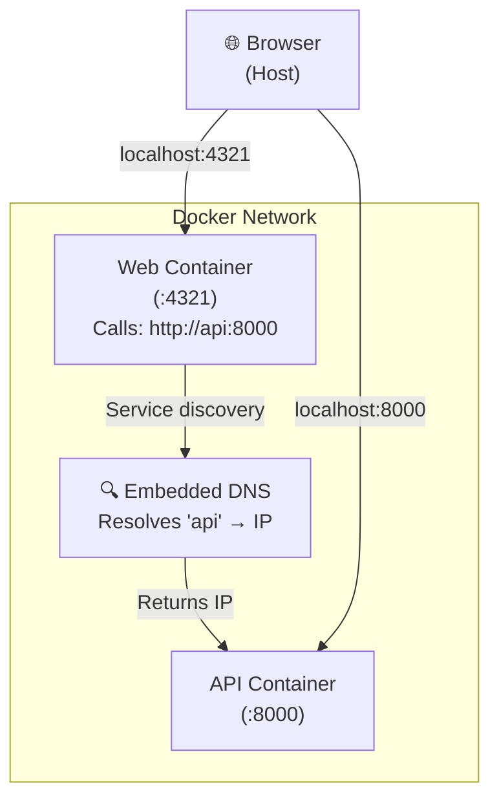

# Layer 1: Individual Docker Images

Run each service in its own Docker container separately to understand container isolation and networking.

## Quick Start

Use scripts for automated setup:

```bash
# Start everything
./scripts/docker-run-local.sh

# Access services
# API: http://localhost:8000
# Web: http://localhost:4321

# Stop everything
./scripts/docker-stop-local.sh
```

See [script documentation](https://github.com/HYP3R00T/gitops-deployment-platform/blob/main/scripts/docker-run-local.sh) for details.

---

## Manual Walkthrough (For Learning)

### Build the API Image

```bash
docker build -t api:latest -f services/api/Dockerfile .
```

Verify:

```bash
docker images | grep api
```

### Build the Web Image

```bash
docker build \
  -t web:latest \
  -f services/web/Dockerfile \
  --build-arg PUBLIC_API_URL=http://localhost:8000 \
  .
```

Note: `PUBLIC_API_URL` is compiled into the image at build time and cannot change at runtime.

### Run Containers on a Shared Network

```bash
# Create network
docker network create local-platform

# Run API
docker run -d --name api --network local-platform -p 8000:8000 api:latest

# Run Web
docker run -d --name web --network local-platform -p 4321:4321 web:latest
```

### Test

```bash
curl http://localhost:8000/health   # API health
curl http://localhost:4321/         # Web loads
curl http://localhost:4321/status   # Services communicate
```

If Web status shows "Backend is unavailable," the image was built with wrong `PUBLIC_API_URL`.

**Fix**: Rebuild Web with container-to-container address:

```bash
docker build \
  -t web:latest \
  -f services/web/Dockerfile \
  --build-arg PUBLIC_API_URL=http://api:8000 \
  .

docker rm web  # Remove old container
docker run -d --name web --network local-platform -p 4321:4321 web:latest
```

Now Web can find API via service name discovery: `http://api:8000`.

## The Container Networking Challenge

???+ danger "Container Network Isolation"
    Inside a container, `localhost` refers to the container itself, not the host machine.

    Web is built with `PUBLIC_API_URL=http://localhost:8000`, so inside its container, it tries to reach localhost-where nothing is listening.

    **Solution**: Rebuild Web with the *correct* internal address: `http://api:8000` (service name on the Docker network).

    This is why the same code behaves differently depending on where it's built. See [Layer 2: Docker Compose](layer-2-docker-compose.md) for how Docker Compose automates this.



**Key difference**: Containers use service names → Docker DNS resolution. Host uses port mappings.

## Configuration

| Variable | Behavior | How to Change |
|----------|----------|---------------|
| `PUBLIC_API_URL` | Compiled at build time; baked into image | Rebuild with new `--build-arg` |
| `LOG_LEVEL` | Runtime environment variable | `docker run -e LOG_LEVEL=debug api:latest` |
| `HOST`, `PORT` | Runtime or Dockerfile default | Override via `-e` at runtime |

For complete environment variable guide, see [Environment Variables Guide](environment-variables-guide.md).

## Cleanup

```bash
docker stop api web && docker rm api web
docker network rm local-platform
```

Or use the stop script:

```bash
./scripts/docker-stop-local.sh
```

## What Works / Doesn't Work

???+ success "What Works"
    - Container isolation and security
    - Production-like image builds
    - Networking via service names
    - Testing individual services

???+ warning "What Doesn't Work"
    - Manual container/network management (tedious)
    - No health checks or startup ordering
    - No automatic dependency resolution
    - Gets complex with multiple containers

## Next: Layer 2

Docker Compose automates network creation, health checks, and startup ordering. See [Layer 2: Docker Compose](layer-2-docker-compose.md).
