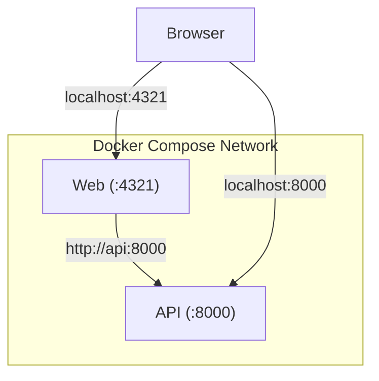

# Layer 2: Docker Compose

Automate containerization, networking, and health checks with one command: `docker compose up -d`.

???+ info "Architecture Details"
    For design decisions about networking, health checks, and Docker Compose concepts, see [Docker Compose Architecture](../docker-compose.md).

## Quick Start

```bash
docker compose up -d
```

This builds both images, creates the network, starts API, waits for health check, then starts Web.

## Docker Compose File

Key sections in `docker-compose.yml`:

- **Services**: API and Web with build context, ports, environment variables
- **Health checks**: API checks `/health` every 10s; Web waits for healthy API
- **Network**: Bridge network for container-to-container communication
- **Dependencies**: Web starts only after API is healthy

For full configuration, see `docker-compose.yml` in the repo root.

## Common Commands & Operations

| Command | Purpose | When |
|---------|---------|------|
| `docker compose up -d` | Start all services | Initial setup |
| `docker compose ps` | Check status + health | Verify startup |
| `docker compose logs -f api` | Stream logs | Debugging; use `web` for web logs |
| `docker compose build api` | Rebuild image | After code changes |
| `docker compose up -d --build` | Rebuild and restart all | Major changes |
| `docker compose down` | Stop and remove | Cleanup |

## Testing

1. **API health**: `curl http://localhost:8000/health` returns `{"healthy": true}`
2. **Web loads**: `curl http://localhost:4321` returns an HTML response
3. **Services communicate**: Visit `http://localhost:4321/status` and confirm "Backend is healthy"
4. **Health status**: `docker compose ps` shows all containers as `(healthy)`

???+ warning "Web Rebuild Required"
    Changes to `PUBLIC_API_URL` or Astro code require rebuild: `docker compose build web && docker compose up -d web`.
    See [Environment Variables Guide](environment-variables-guide.md) for why.

## How Services Communicate



Containers use service names + container ports for internal communication (`http://api:8000`). Host  uses localhost + port mappings.

## Configuration Reference

**PUBLIC_API_URL**: Locked at build time. See [Environment Variables Guide](environment-variables-guide.md).

**LOG_LEVEL & other runtime variables**: Can be changed anytime.

```yaml
api:
  environment:
    - LOG_LEVEL=debug  # Change and restart to apply
```

**Port mapping** format: `host:container`

```yaml
ports:
    - "8000:8000"  # Host 8000 to container 8000
```

Between containers, always use container ports (never host ports).

## Troubleshooting

| Problem | Cause | Fix |
|---------|-------|-----|
| Web can't reach API | API not healthy yet | Wait 30s; check `docker compose logs api` |
| Status page shows "Backend unavailable" | Web built with wrong `PUBLIC_API_URL` | Rebuild: `docker compose build web && up -d` |
| Port already in use | Another service on port 8000 or 4321 | Change in docker-compose.yml or stop other service |

## What Works / Doesn't Work

???+ success "What Works"
    - Automated orchestration
    - Service discovery via DNS
    - Health check dependencies
    - Fast iteration cycle
    - Reproducibility

???+ warning "What Doesn't Work"
    - Multi-machine deployment (only single host)
    - Scaling (can't run multiple replicas easily)
    - Cluster management (no auto-recovery)

## Next Steps

1. **Experiment locally**: Modify Dockerfiles, run `docker compose build && up -d`
2. **Move to Kubernetes**: See [Layer 3: Kubernetes with kind](layer-3-kubernetes-kind.md)
3. **Debug issues**: Use `docker compose logs` to diagnose problems

## See Also

- [Docker Compose Architecture](../docker-compose.md) - Design decisions and deep dive
- [Environment Variables Guide](environment-variables-guide.md) - Configure by layer
- [API Service](../../services/api.md)
- [Web Service](../../services/web.md)
