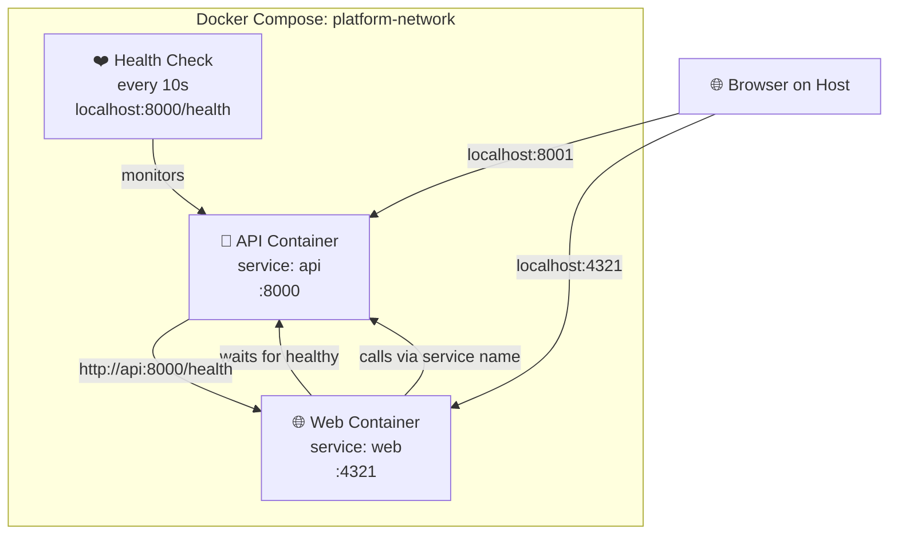

# Layer 2: Docker Compose

Docker Compose automates the manual orchestration from Layer 1.

## Why Layer 2?

This layer automates **container building, networking, health checks, and dependencies**. One command: `docker compose up -d`.

## The Docker Compose File

See `docker-compose.yml` in the repository root. Key sections:

```yaml
services:
  api:
    build:
      context: .
      dockerfile: services/api/Dockerfile
    image: api:latest
    ports:
      - "8001:8000"  # Host:Container
    environment:
      - LOG_LEVEL=info
    healthcheck:
      test: ["CMD", "python", "-c", "import urllib.request; urllib.request.urlopen('http://localhost:8000/health')"]
      interval: 10s
      timeout: 5s
      retries: 3

  web:
    build:
      context: .
      dockerfile: services/web/Dockerfile
      args:
        PUBLIC_API_URL: http://api:8000  # Baked into image at build
    image: web:latest
    ports:
      - "4321:4321"
    depends_on:
      api:
        condition: service_healthy

networks:
  platform-network:
    driver: bridge
```

## Starting the Stack

```bash
docker compose up -d
```

What happens:

1. Builds API image (if needed)
2. Builds Web image with `PUBLIC_API_URL=http://api:8000` (if needed)
3. Creates `platform-network` bridge network
4. Starts API container on the network
5. Runs API health check every 10s
6. Once API is healthy, starts Web container
7. Returns

Output:

```sh
[+] Building 50.2s (28/28) FINISHED
 => [api stage-0] ...
 => [web build] ...

[+] Running 3/3
 ✔ Network gitops-deployment-platform_platform-network  Created
 ✔ Container platform-api  Healthy
 ✔ Container platform-web  Started
```

## Checking Status

```bash
docker compose ps
```

Expected:

```sh
NAME           IMAGE      COMMAND                 STATUS
platform-api   api:latest python -m api.main     Up (healthy)
platform-web   web:latest node ./dist/server/... Up
```

## Testing

### Browser Access (Host)

```bash
# Web interface
open http://localhost:4321

# API health (note: port 8001, not 8000)
curl http://localhost:8001/health
```

Expected:

```json
{"healthy": true}
```

### Status Page

```bash
curl http://localhost:4321/status
```

Expected (in HTML):

```sh
✓ Backend is healthy
```

### Container-to-Container Communication

Web inside its container calls:

```sh
http://api:8000/health
```

This works because:

- `api` resolves to the API container via Docker's embedded DNS
- `:8000` is the port inside the API container
- Port mapping `8001:8000` only affects host access

## Stopping the Stack

```bash
docker compose down
```

Cleanup:

```sh
✔ Container platform-api  Removed
✔ Container platform-web  Removed
✔ Network gitops-deployment-platform_platform-network  Removed
```

## Rebuilding After Changes

### Change API code, rebuild, restart

```bash
docker compose build api
docker compose up -d api
```

### Change Web code, rebuild, restart

```bash
docker compose build web
docker compose up -d web
```

### Change PUBLIC_API_URL, rebuild web

```yaml
# In docker-compose.yml, change the build arg:
web:
  build:
    args:
      PUBLIC_API_URL: http://api:9000  # Different port
```

Then rebuild:

```bash
docker compose build web
docker compose up -d web
```

## How They Communicate (Layer 2)



## Environment Variables in Layer 2

### PUBLIC_API_URL (Web)

- **Set at**: Build time (as `--build-arg`)
- **Value**: `http://api:8000`
- **Can change at runtime**: ❌ No (compiled into Docker image)
- **How to change**: Edit docker-compose.yml build args, rebuild, restart

### LOG_LEVEL (API)

- **Set at**: Runtime (as environment variable)
- **Value**: `info` (default)
- **Can change at runtime**: ✅ Yes
- **How to change**:

  ```yaml
  # In docker-compose.yml
  api:
    environment:
      - LOG_LEVEL=debug
  ```

  Then restart: `docker compose up -d api`

## Port Mapping Explained

In docker-compose.yml:

```yaml
api:
  ports:
    - "8001:8000"    # Host:Container
```

- **Host port (8001)**: What your browser uses → `http://localhost:8001`
- **Container port (8000)**: What API listens on inside the container
- **Between containers**: Still use container port → `http://api:8000`

**Why different host/container ports?**

- Port 8000 is reserved for Zensical (documentation)
- So API mapping is `8001:8000`
- Web mapping is `4321:4321` (same on both)

## Logs

### View All Logs

```bash
docker compose logs -f
```

### View API Logs

```bash
docker compose logs -f api
```

### View Web Logs

```bash
docker compose logs -f web
```

### Exit

Press `Ctrl+C` to stop following logs.

## What Works in Layer 2

- ✅ **Automated orchestration**: One command to build and run everything
- ✅ **Service discovery**: `http://api:8000` just works
- ✅ **Health checks**: API waits, Web waits for API
- ✅ **Dependency ordering**: Web doesn't start until API is healthy
- ✅ **Environment consistency**: Same setup every time
- ✅ **Easy cleanup**: `docker compose down` removes everything

## What Doesn't Work in Layer 2

- ❌ **Multi-machine**: Only works on a single Docker host
- ❌ **No scaling**: Can't easily run multiple replicas
- ❌ **No cluster management**: No load balancing, no auto-recovery

## Comparison: Layer 0 → 1 → 2

| Aspect | Layer 0 | Layer 1 | Layer 2 |
|--------|---------|---------|---------|
| **Execution** | Native Python/Node | Docker containers | Docker Compose |
| **Communication** | Direct localhost | Service names + network | Service names + network |
| **Setup Time** | 2 minutes | 5 minutes (manual) | 30 seconds |
| **Reproducibility** | Low | Medium | High |
| **Production-like** | No | Partial | Yes (for local) |
| **Manual work** | High | Very high | Low |

## Next Steps

From here, you can:

1. **Modify and experiment**: Change Dockerfiles, environment variables, see effects
2. **Deploy to Kubernetes**: See [Local Kubernetes](../local-kubernetes.md) for kind cluster setup
3. **Debug issues**: Use `docker compose logs` to troubleshoot
4. **Clean up**: `docker compose down && docker system prune`

## See Also

- [Environment Variables Across Layers](environment-variables-guide.md) - Decision table for which variables to edit
- [API Service](../../services/api.md) - Service endpoints
- [Web Service](../../services/web.md) - Frontend pages
