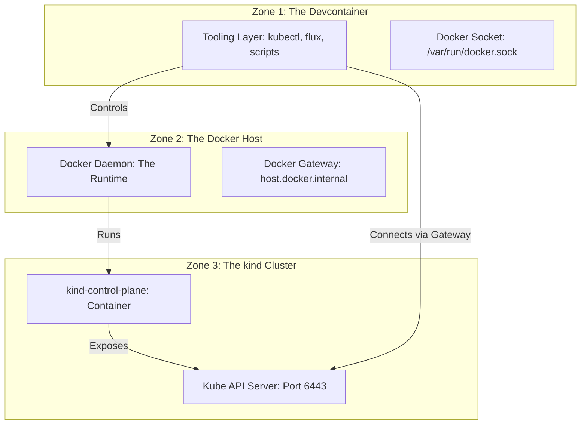

# Local Kubernetes Architecture (kind + Devcontainers)

This document explains **why** we run Kubernetes locally, **how** we architect the environment using **kind** and **Devcontainers**, and the specific networking constraints required to make them talk to each other.

## 1. Purpose: Why Local Kubernetes?

This project focuses on **GitOps as a delivery model**. Before introducing the complexity of cloud providers (AWS EKS, IAM, VPCs), we must validate our delivery pipeline in a controlled, disposable environment.

We use **kind (Kubernetes IN Docker)** because it provides a fully compliant Kubernetes control plane that runs cheaply on a developer's machine. It allows us to prove that **a Git commit alone is sufficient to create, update, and destroy workloads.**

## 2. The "Three Zones" Architecture

Confusion often arises because this setup involves three distinct network namespaces (zones). Understanding where a command runs versus where it executes is critical.



### Zone 1: The Devcontainer (Tooling)

- **Role:** The client environment.
- **What runs here:** `kubectl`, `flux`, `terraform`, and your shell.
- **Networking:** Isolated network namespace. `localhost` (127.0.0.1) refers to _this container only_.
- **Constraint:** It cannot "see" the host's localhost directly.

### Zone 2: The Docker Host (Runtime)

- **Role:** The engine running your infrastructure.
- **What runs here:** The Docker Daemon and the `kind` containers.
- **Networking:** Binds ports to the host machine (e.g., your laptop).
- **Constraint:** This is where `kind` publishes the Kubernetes API port (6443).

# Zone 3: The kind Cluster (Workload)

- **Role:** The Kubernetes control plane.
- **What runs here:** The API Server, Controller Manager, Scheduler.
- **Networking:** Runs inside a Docker container (`kind-control-plane`) on a custom bridge network.
- **Constraint:** The API server listens on port 6443 _inside_ this container.

???+ warning "Devcontainer vs Host"
    Never assume `localhost` inside the devcontainer can reach the Kubernetes API. Always use `host.docker.internal` and the patched kubeconfig to avoid silent connection failures.

## 3. The "Localhost Trap" & The Solution

When you run `kind create cluster` inside the devcontainer, `kind` (talking to the Docker Host) creates a cluster and generates a kubeconfig file.

### The Problem

By default, `kind` assumes you are running `kubectl` on the Host. It generates a config pointing to:
`server: https://127.0.0.1:<random-port>`

If you try to use this from **Zone 1 (Devcontainer)**, it fails:

1. `kubectl` tries to connect to `127.0.0.1`.
2. It hits the **Devcontainer's** localhost.
3. Nothing is listening there (the cluster is in Zone 2/3).
4. **Result:** `connection refused`.

### The Solution: Deterministic Routing

We must force traffic to leave Zone 1, traverse Zone 2, and land in Zone 3.

#### Step 1: Fix the Port (Determinism)

We use a configuration file to force `kind` to expose the API server on a predictable port (`6443`) on the Docker Host.

See the configuration in `local/kubernetes/kind.yaml`:

- Sets `apiServerPort: 6443` for deterministic port binding
- Ensures consistent setup across all environments

#### Step 2: Fix the Route (host.docker.internal)

We cannot use `127.0.0.1`. Instead, we use `host.docker.internal`.

- **What it is:** A special DNS name injected by Docker.
- **What it does:** It resolves to the **Gateway IP** of the Docker Host (Zone 2) visible from the container.
- **The Path:** Devcontainer -> Docker Gateway -> Host Port 6443 -> kind Container.

#### Step 3: Fix the TLS Identity (SNI)

The Kubernetes API certificate is generated for `localhost`, `kubernetes`, etc. It is _not_ generated for `host.docker.internal`.
Connecting via the gateway IP would normally cause a TLS error ("Certificate name mismatch").

- **Fix:** We pass `--tls-server-name=localhost`. This tells `kubectl` to request the "localhost" identity during the TLS handshake, satisfying the certificate validation.

## 4. Implementation Guide

### Prerequisites

The devcontainer configuration includes the required Docker features. See `.devcontainer/devcontainer.json` for the complete setup:

- `docker-outside-of-docker` - Allows devcontainer to control the host Docker daemon
- `kind` - Provides kind CLI for cluster management

This configuration is already in place and enables the devcontainer (Zone 1) to control the Docker daemon (Zone 2).

### Setup Script

We automate the cluster creation and config patching to ensure reproducibility.

```bash
# 1. Create the cluster with a fixed port
kind create cluster --config kind.yaml

# 2. Patch the kubeconfig to use the Docker Gateway and TLS override
kubectl config set-cluster kind-kind \
  --server=https://host.docker.internal:6443 \
  --tls-server-name=localhost

```

### Verification

Run the following to verify the connection works across zones:

```bash
kubectl get nodes

```

**Success Output:**

```text
NAME                 STATUS   ROLES           AGE     VERSION
kind-control-plane   Ready    control-plane   2m41s   v1.35.0

```

## 5. Summary

By understanding that **Devcontainers are clients** and **Kind is the server running on the Host**, we simply need to route traffic correctly.

1. **Zone 1 (Dev)** needs to reach **Zone 2 (Host)**.
2. We use `host.docker.internal` as the bridge.
3. We pin the port to `6443` to stop guessing.
4. We override TLS SNI to keep the connection secure but functional.
